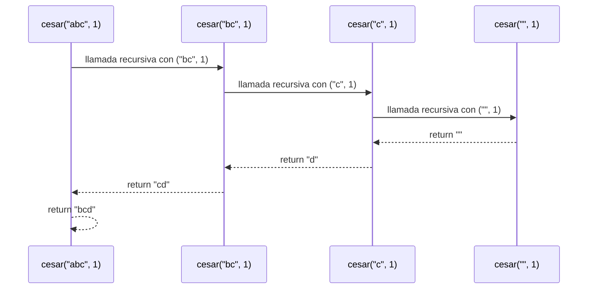
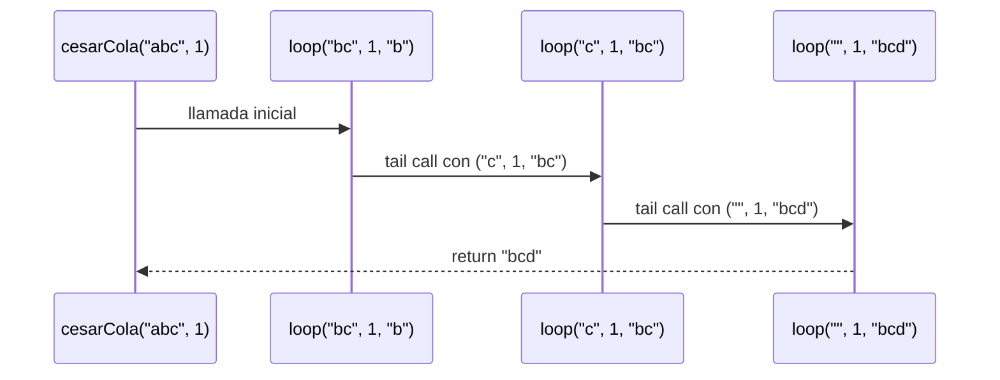
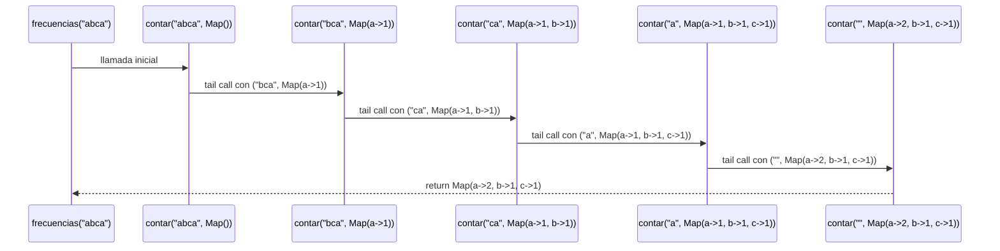
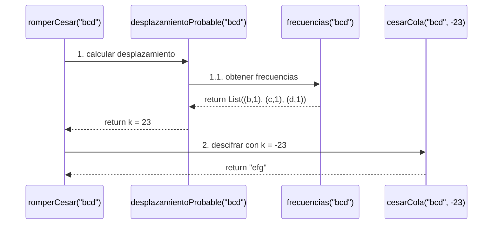
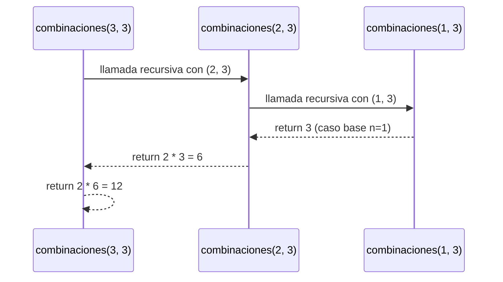
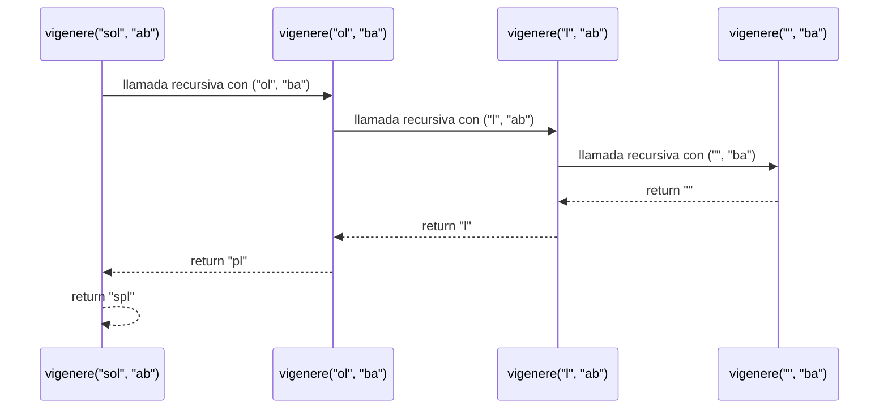

# Informe de Proceso - Taller 1

## 1. Introducción

En este taller se implementaron diferentes algoritmos relacionados con los cifrados clásicos utilizando programación funcional y recursión en Scala.

El objetivo principal es analizar cómo se ejecutan las funciones, observar el comportamiento de la recursión y representar el estado de la pila de llamados durante la ejecución.

Los puntos desarrollados fueron:

-   **Punto 1:** Cifrado César con recursión lineal.

-   **Punto 2:** Cifrado César con recursión de cola.

-   **Punto 3:** Conteo de frecuencias con recursión de cola.

-   **Punto 4:** Romper un César por análisis de frecuencias.

-   **Punto 5:** Vigenère y Conteo de mensajes.

-   **Punto 0:** Cesar y CesarCola con (casa,3).


    

# 1.3. Punto 1: Cifrado César con recursión lineal

## Descripción

El cifrado César consiste en desplazar cada letra de un mensaje una cantidad determinada de posiciones dentro del alfabeto.

En este punto se implementa el cifrado mediante **recursión lineal**. La función recibe un mensaje `m` y un desplazamiento `k`. En cada llamada se toma el primer carácter del mensaje mediante `m.head`, se procesa y posteriormente se realiza una nueva llamada recursiva utilizando el resto del mensaje mediante `m.tail`.

Los caracteres que no son letras minúsculas entre `a` y `z` no se modifican.

La función termina cuando el mensaje queda vacío.

## Código

Scala

```
def cesar(m: Mensaje, k: Int): Mensaje = {
  if (m.isEmpty) ""
  else {
    val c = m.head
    val nuevaLetra = if (esMinuscula(c)) {
      val desplazado =
        ((c.toInt - primera + k) % letras + letras) % letras + primera
      desplazado.toChar
    } else c

    nuevaLetra + cesar(m.tail, k)
  }
}

```

La función utiliza además:

Scala

```
def esMinuscula(c: Char): Boolean =
  c >= 'a' && c <= 'z'

val letras = 26
val primera = 'a'.toInt

```

## Ejecución paso a paso

Para observar el funcionamiento se utiliza el siguiente ejemplo:

Scala

```
cesar("abc",3)

```

El desplazamiento es `1`, por lo que cada letra se mueve una posición:

-   `a` -> `b`

-   `b` -> `c`

-   `c` -> `d`

### Cálculo de cada letra

Con la fórmula `((c.toInt - primera + k) % letras + letras) % letras + primera`, donde `primera = 97` y `k = 1`:

| Letra | `c.toInt` | `c.toInt - primera` | `+ k` | `% 26` (luego `+ 26`, `% 26`) | `+ primera` | Resultado |
|:-----:|:---------:|:-------------------:|:-----:|:-----------------------------:|:-----------:|:---------:|
| `a` | 97 | 0 | 1 | 1 | 98 | `b` |
| `b` | 98 | 1 | 2 | 2 | 99 | `c` |
| `c` | 99 | 2 | 3 | 3 | 100 | `d` |

Como ningún resultado pasa de 25, el `% 26` no cambia el valor. Con `zzz` y `k = 1` sí se vería: `25 + 1 = 26` y `26 % 26 = 0`, que vuelve a la `a`.


### Paso 1

Se ejecuta:


```
cesar("abc", 1)

```

El mensaje no está vacío.

Se obtiene:


```
m.head = 'a'
m.tail = "bc"

```

Como `a` es una letra minúscula, se calcula su desplazamiento.

El resultado es:


```
'a' -> 'b'

```

Después se realiza la llamada recursiva:


```
cesar("bc", 1)

```

Pero la función todavía tiene pendiente concatenar la letra `'b'` con el resultado de la llamada recursiva.

### Paso 2

Ahora se ejecuta:


```
cesar("bc", 1)

```

Se obtiene:


```
m.head = 'b'
m.tail = "c"

```

La letra `b` se desplaza una posición:


```
'b' -> 'c'

```

Se realiza otra llamada:


```
cesar("c", 1)

```

### Paso 3

Se ejecuta:


```
cesar("c", 1)

```

Se obtiene:


```
m.head = 'c'
m.tail = ""

```

La letra se desplaza:


```
'c' -> 'd'

```

Luego se realiza:


```
cesar("", 1)

```

### Paso 4: caso base

Como el mensaje está vacío:

Scala

```
if (m.isEmpty) ""

```

la función devuelve:


```
""

```

La llamada comienza a retornar.


```
cesar("", 1) -> ""

```

Después:


```
cesar("c", 1)
-> "d" + ""
-> "d"

```

Después:


```
cesar("bc", 1)
-> "c" + "d"
-> "cd"

```

Finalmente:


```
cesar("abc", 1)
-> "b" + "cd"
-> "bcd"

```

### Estado de la pila paso a paso

Cada llamado deja una **operación pendiente** (`nuevaLetra + ...`), así que su marco no se puede liberar hasta que regrese la llamada siguiente. La pila se muestra con el tope arriba.

**Fase de ida: la pila crece**

```text
Paso 1:
  [1] cesar("abc", 1)   nuevaLetra = 'b'   pendiente: 'b' + ?
Profundidad: 1

Paso 2:
  [2] cesar("bc", 1)    nuevaLetra = 'c'   pendiente: 'c' + ?
  [1] cesar("abc", 1)   nuevaLetra = 'b'   pendiente: 'b' + ?
Profundidad: 2

Paso 3:
  [3] cesar("c", 1)     nuevaLetra = 'd'   pendiente: 'd' + ?
  [2] cesar("bc", 1)    nuevaLetra = 'c'   pendiente: 'c' + ?
  [1] cesar("abc", 1)   nuevaLetra = 'b'   pendiente: 'b' + ?
Profundidad: 3

Paso 4 (caso base, máxima profundidad):
  [4] cesar("", 1)      caso base: devuelve ""
  [3] cesar("c", 1)     nuevaLetra = 'd'   pendiente: 'd' + ?
  [2] cesar("bc", 1)    nuevaLetra = 'c'   pendiente: 'c' + ?
  [1] cesar("abc", 1)   nuevaLetra = 'b'   pendiente: 'b' + ?
Profundidad: 4
```

**Fase de vuelta: la pila se vacía**

```text
Retorna [4] con ""      ->  [3] calcula 'd' + ""     = "d"     (pila: 3 marcos)
Retorna [3] con "d"     ->  [2] calcula 'c' + "d"    = "cd"    (pila: 2 marcos)
Retorna [2] con "cd"    ->  [1] calcula 'b' + "cd"   = "bcd"   (pila: 1 marco)
Retorna [1] con "bcd"                                         (pila: vacía)
```


### Pila de llamados

Fragmento de código



### Resultado


```
cesar("abc", 1) -> "bcd"

```

# 1.4. Punto 2: Cifrado César con recursión de cola

## Descripción

En este punto se implementa nuevamente el cifrado César, pero utilizando **recursión de cola**.

La función `cesarCola` utiliza un parámetro adicional llamado `acc`, que funciona como acumulador. En cada llamada se procesa una letra y el resultado se agrega al acumulador.

La llamada recursiva es la última operación realizada por la función:

Scala

```
cesarCola(m.tail, k, acc + nuevaLetra)

```

Por esta razón, la función puede ser optimizada por el compilador como una recursión de cola.

## Código

Scala

```
@tailrec
final def cesarCola(
  m: Mensaje,
  k: Int,
  acc: Mensaje = ""
): Mensaje = {

  if (m.isEmpty) acc
  else {
    val c = m.head

    val nuevaLetra = if (esMinuscula(c)) {
      val desplazado =
        ((c.toInt - primera + k) % letras + letras) % letras + primera
      desplazado.toChar
    } else c

    cesarCola(m.tail, k, acc + nuevaLetra)
  }
}

```

## Ejecución paso a paso

Se utiliza el mismo ejemplo para poder comparar ambos métodos:

Scala

```
cesarCola("abc", 1)

```

Inicialmente:


```
m = "abc"
k = 1
acc = ""

```

### Paso 1

Se procesa la primera letra:


```
m.head = 'a'

```

La letra se desplaza:


```
'a' -> 'b'

```

El acumulador pasa de:


```
""

```

a:


```
"b"

```

Se realiza:


```
cesarCola("bc", 1, "b")

```

### Paso 2

Se procesa:


```
m = "bc"
acc = "b"

```

La letra `b` se convierte en `c`.

El acumulador queda:


```
"bc"

```

Se llama:


```
cesarCola("c", 1, "bc")

```

### Paso 3

Se procesa:


```
m = "c"
acc = "bc"

```

La letra `c` se convierte en `d`.

El acumulador queda:


```
"bcd"

```

Se llama:


```
cesarCola("", 1, "bcd")

```

### Paso 4: caso base

El mensaje está vacío:


```
m.isEmpty = true

```

Por lo tanto:

Scala

```
if (m.isEmpty) acc

```

devuelve:


```
"bcd"

```


### Estado de la pila paso a paso

En cada paso la llamada recursiva es lo **último** que hace la función. Como no queda nada pendiente, el marco actual se **reutiliza** para el siguiente llamado, solo con las variables actualizadas. Por eso la pila siempre tiene un solo marco.

```text
Paso 1:  [1] cesarCola(m = "abc", k = 1, acc = "")      'a' -> 'b'
Profundidad: 1

Paso 2:  [1] cesarCola(m = "bc",  k = 1, acc = "b")     'b' -> 'c'    <- mismo marco
Profundidad: 1

Paso 3:  [1] cesarCola(m = "c",   k = 1, acc = "bc")    'c' -> 'd'    <- mismo marco
Profundidad: 1

Paso 4:  [1] cesarCola(m = "",    k = 1, acc = "bcd")   caso base: devuelve acc
Profundidad: 1
```

No hay fase de vuelta: cuando se llega al caso base, el resultado ya está completo en `acc` y se devuelve directamente.


### Pila de llamados

A diferencia de la recursión lineal, no hay una concatenación pendiente después de la llamada recursiva. Las llamadas se representan mediante llamadas de cola:

Fragmento de código



### Resultado


## ¿Por qué una pila crece y la otra no?

La diferencia está en lo que ocurre **después** de la llamada recursiva.

**En `cesar` (lineal)**, la llamada recursiva está dentro de una expresión:

```scala
nuevaLetra + cesar(m.tail, k)
```

Cuando se hace la llamada a `cesar(m.tail, k)`, todavía falta hacer la suma `nuevaLetra + ...`. Para eso el marco actual debe **conservarse en la pila**, con su valor de `nuevaLetra`, hasta que regrese la llamada. Cada letra del mensaje apila un marco nuevo y ninguno se libera hasta llegar al caso base. Para un mensaje de $n$ letras, la profundidad máxima es $n + 1$ marcos. Para `"abc"` fueron 4. Con un mensaje muy largo esto puede producir un `StackOverflowError`.

**En `cesarCola` (de cola)**, la llamada recursiva es la **última** acción de la función:

```scala
cesarCola(m.tail, k, acc + nuevaLetra)
```

No queda ninguna operación pendiente. Todo lo que el marco actual sabía ya está resumido en los argumentos de la llamada (`m.tail`, `k`, `acc + nuevaLetra`). Por eso el marco actual ya no se necesita, y con `@tailrec` el compilador lo convierte en un ciclo que **reutiliza el mismo marco**. La profundidad de la pila es siempre 1, sin importar el largo del mensaje.

| | `cesar("abc", 1)` | `cesarCola("abc", 1)` |
|:--|:--:|:--:|
| Operación pendiente tras la llamada | `nuevaLetra + ...` | ninguna |
| Dónde se arma el resultado | al **regresar** de las llamadas | en `acc`, al **ir** |
| Profundidad máxima de la pila | $n + 1 = 4$ | $1$ |
| Fase de vuelta | sí (3 concatenaciones pendientes) | no |
| Crece con el largo del mensaje | sí, proporcional a $n$ | no, constante |

El acumulador `acc` sí crece, pero vive en el montón (es el resultado mismo) y no en la pila.

# 1.5. Punto 3: Conteo de frecuencias con recursión de cola

## Descripción

El objetivo de este punto es contar cuántas veces aparece cada letra minúscula dentro de un mensaje.

Para realizarlo se utiliza una función auxiliar llamada `contar`, que recorre el mensaje mediante recursión de cola y utiliza un `Map[Char, Int]` como acumulador.

Cada vez que aparece una letra, se incrementa su contador. Los caracteres que no son letras minúsculas se ignoran.

Una vez terminado el recorrido, el mapa se convierte en una lista y se ordena de mayor a menor frecuencia. En caso de empate, se utiliza el orden alfabético.

## Código

Scala

```
def frecuencias(m: Mensaje): Frecuencias = {

  @tailrec
  def contar(
    m: Mensaje,
    acc: Map[Char, Int]
  ): Map[Char, Int] = {

    if (m.isEmpty) acc
    else {
      val c = m.head

      val nuevaAcc = if (esMinuscula(c)) {
        acc + (c -> (acc.getOrElse(c, 0) + 1))
      } else acc

      contar(m.tail, nuevaAcc)
    }
  }

  val freqMap = contar(m, Map.empty)

  freqMap.toList.sortBy {
    case (c, count) => (-count, c)
  }
}

```

## Ejecución paso a paso

Se utiliza el mensaje:

Scala

```
frecuencias("abca")

```

El resultado esperado es:


```
List((a,2), (b,1), (c,1))

```

### Paso 1

Se ejecuta:


```
contar("abca", Map.empty)

```

La primera letra es:


```
'a'

```

Como es minúscula, se agrega al mapa:

```
Map(a -> 1)

```

Se realiza:


```
contar("bca", Map(a -> 1))

```

### Paso 2

Ahora:


```
m = "bca"
acc = Map(a -> 1)

```

La letra es:


```
'b'

```

El mapa queda:


```
Map(a -> 1, b -> 1)

```

Nueva llamada:


```
contar("ca", Map(a -> 1, b -> 1))

```

### Paso 3

La letra es:


```
'c'

```

El mapa queda:


```
Map(a -> 1, b -> 1, c -> 1)

```

Nueva llamada:


```
contar("a", Map(a -> 1, b -> 1, c -> 1))

```

### Paso 4

La letra es:


```
'a'

```

Como `a` ya existe en el mapa, se incrementa su frecuencia:


```
Map(a -> 2, b -> 1, c -> 1)

```

Se realiza:


```
contar("", Map(a -> 2, b -> 1, c -> 1))

```

### Paso 5: caso base

El mensaje está vacío.

Por lo tanto:

Scala

```
if (m.isEmpty) acc

```

devuelve:


```
Map(a -> 2, b -> 1, c -> 1)

```

Después, `frecuencias` convierte el mapa en una lista y la ordena:


```
List((a,2), (b,1), (c,1))

```

### Pila de llamados

Fragmento de código



### Resultado


```
frecuencias("abca")
-> List((a,2), (b,1), (c,1))

```

# 1.6. Punto 4: Romper un César por análisis de frecuencias

## Descripción

En este punto se intenta recuperar un mensaje que fue cifrado mediante César utilizando un análisis de frecuencias.

La idea utilizada por el programa es suponer que la letra que aparece con mayor frecuencia en el mensaje cifrado corresponde a la letra `e` del mensaje original.

Para realizar este proceso se utilizan dos funciones:


```
desplazamientoProbable()
romperCesar()

```

`desplazamientoProbable` obtiene las frecuencias del mensaje y determina cuál es la letra que aparece con mayor frecuencia.

Después calcula la distancia entre esa letra y `e`.

Finalmente, `romperCesar` utiliza el desplazamiento calculado, pero en sentido contrario, para intentar descifrar el mensaje mediante `cesarCola`.

## Código

### Función `desplazamientoProbable`

Scala

```
def desplazamientoProbable(m: Mensaje): Int = {
  val freq = frecuencias(m)

  if (freq.isEmpty) 0
  else {
    val letraMasFrecuente = freq.head._1

    val desplazamiento = letraMasFrecuente - 'e'

    if (desplazamiento < 0)
      desplazamiento + letras
    else
      desplazamiento
  }
}

```

### Función `romperCesar`

Scala

```
def romperCesar(m: Mensaje): Mensaje = {
  val k = desplazamientoProbable(m)
  cesarCola(m, -k)
}

```

## Ejecución paso a paso

Para entender el proceso se puede utilizar un mensaje cifrado sencillo:

Scala

```
romperCesar("bcd")

```

Primero se llama:


```
romperCesar("bcd")

```

La función necesita conocer el desplazamiento probable, por lo que realiza:


```
desplazamientoProbable("bcd")

```

### Paso 1: calcular las frecuencias

`desplazamientoProbable` llama a:


```
frecuencias("bcd")

```

Esta función recorre el mensaje.

Las frecuencias obtenidas son:


```
b -> 1
c -> 1
d -> 1

```

Como todas tienen la misma frecuencia, la lista queda ordenada alfabéticamente:

```
List((b,1), (c,1), (d,1))

```

La primera letra es:


```
b

```

Por lo tanto:


```
letraMasFrecuente = 'b'

```

### Paso 2: calcular el desplazamiento

Se calcula:

Scala

```
'b' - 'e'

```
vigenere("sol", "ab") -> "spl"


# Punto 0: CESAR Y CESARCOLA con (casa,3)

## 1. Cifrado César con Recursión Lineal: `cesar("casa", 3)`

### Ejecución paso a paso

Scala

La distancia es negativa, por lo que se suma `26`.

El desplazamiento utilizado por el programa es:


```
23

```

Luego `romperCesar` utiliza el valor contrario:


```
-k = -23

```

y llama:


```
cesarCola("bcd", -23)

```
cesar("casa", 3) -> "fdvd"

El resultado equivale a desplazar las letras tres posiciones hacia adelante:


```
b -> e
c -> f
d -> g

```

Por lo tanto:


```
romperCesar("bcd") -> "efg"

```

### Pila de llamados

El flujo principal entre funciones y llamadas recursivas se representa a continuación:

Fragmento de código



### Resultado


```
romperCesar("bcd") -> "efg"

```
# 1.7. Punto 5: Vigenère y Conteo de mensajes

## Descripción

En este punto se desarrollan dos conceptos: la función `combinaciones` y el algoritmo de cifrado `vigenere`.

### 1. Combinaciones

Calcula cuántos mensajes de longitud `n` se pueden formar utilizando un alfabeto de `a` letras, con la restricción de que **no pueden haber dos letras iguales seguidas**.

-   Para la primera posición hay `a` opciones.

-   Para las posiciones subsecuentes hay `(a - 1)` opciones disponibles.

-   La función se implementa mediante **recursión lineal**.


### 2. Cifrado Vigenère

El cifrado Vigenère es un cifrado polialfabético en el cual cada letra del mensaje se desplaza según la posición de la letra correspondiente de una `clave`.

-   Si la letra del mensaje es una minúscula (`'a'` a `'z'`), se calcula el desplazamiento tomando la letra actual de la clave (`clave.head - 'a'`).

-   Al procesar una letra válida, la clave se rota cíclicamente para la siguiente llamada recursiva: `clave.tail + clave.head`.

-   Si el carácter no es una letra minúscula, se conserva sin modificar y **no consume ni rota** la clave.

-   Se implementa mediante **recursión lineal**, dejando pendiente la concatenación de la letra procesada con el resultado de la llamada recursiva.


## Código

Scala

```
/**
  * Cuántos mensajes de longitud n se forman con a letras sin dos iguales seguidas.
  */
def combinaciones(n: Int, a: Int): BigInt = {
  if (n == 0) BigInt(1)
  else if (n == 1) BigInt(a)
  else {
    BigInt(a - 1) * combinaciones(n - 1, a)
  }
}

/**
  * Vigenère: cada letra se corre según la letra de la clave que le toca.
  * Lo que no es letra minúscula se copia y no consume clave.
  */
def vigenere(m: Mensaje, clave: Clave): Mensaje = {
  if (m.isEmpty) ""
  else {
    val c = m.head
    if (clave.isEmpty) m
    else {
      if (esMinuscula(c)) {
        val desplazamiento = clave.head - 'a'
        val letra = ((c - 'a' + desplazamiento) % 26 + 'a').toChar

        letra + vigenere(m.tail, clave.tail + clave.head)
      } else {
        c + vigenere(m.tail, clave)
      }
    }
  }
}

```

## Ejecución paso a paso: `combinaciones(3, 3)`

Para observar el funcionamiento se utiliza el ejemplo con `n = 3` (longitud) y `a = 3` (letras del alfabeto):

Scala

```
combinaciones(3, 3)

```

### Paso 1

Se evalúa `n = 3` y `a = 3`. No es `0` ni `1`. Se calcula `(3 - 1) = 2`. Queda pendiente la multiplicación `2 * combinaciones(2, 3)`.

### Paso 2

Se ejecuta `combinaciones(2, 3)`. No es `0` ni `1`. Se calcula `(3 - 1) = 2`. Queda pendiente la multiplicación `2 * combinaciones(1, 3)`.

### Paso 3: Caso Base

Se ejecuta `combinaciones(1, 3)`. Como `n == 1`, se activa el caso base que devuelve `BigInt(3)`.

### Desapilado y Retorno

-   `combinaciones(1, 3)` devuelve `3`.

-   `combinaciones(2, 3)` realiza `2 * 3` y devuelve `6`.

-   `combinaciones(3, 3)` realiza `2 * 6` y devuelve `12`.


### Pila de llamados (`combinaciones`)

Fragmento de código


### Resultado


```
combinaciones(3, 3) -> 12

```

## Ejecución paso a paso: `vigenere("sol", "ab")`

Para observar el funcionamiento del cifrado se utiliza el mensaje `"sol"` con la clave `"ab"`:

Scala

```
vigenere("sol", "ab")

```

### Paso 1

Se ejecuta:


```
vigenere("sol", "ab")

```

-   `m.head = 's'`, `m.tail = "ol"`

-   `clave.head = 'a'`, `clave.tail = "b"`

-   Desplazamiento de `'a'`: `0`

-   `'s'` + 0 = `'s'`

-   Nueva clave rotada: `"b" + "a" = "ba"`


Queda pendiente concatenar `'s'` con el resultado de la llamada recursiva:


```
vigenere("ol", "ba")

```

### Paso 2

Se ejecuta:


```
vigenere("ol", "ba")

```

-   `m.head = 'o'`, `m.tail = "l"`

-   `clave.head = 'b'`, `clave.tail = "a"`

-   Desplazamiento de `'b'`: `1`

-   `'o'` + 1 = `'p'`

-   Nueva clave rotada: `"a" + "b" = "ab"`


Queda pendiente concatenar `'p'` con la llamada:


```
vigenere("l", "ab")

```

### Paso 3

Se ejecuta:


```
vigenere("l", "ab")

```

-   `m.head = 'l'`, `m.tail = ""`

-   `clave.head = 'a'`, `clave.tail = "b"`

-   Desplazamiento de `'a'`: `0`

-   `'l'` + 0 = `'l'`

-   Nueva clave rotada: `"b" + "a" = "ba"`


Queda pendiente concatenar `'l'` con la llamada:


```
vigenere("", "ba")

```

### Paso 4: Caso Base

El mensaje está vacío (`m.isEmpty = true`). Devuelve `""`.

### Desapilado y Retorno

-   `vigenere("", "ba")` -> `""`

-   `vigenere("l", "ab")` -> `'l' + ""` ->`"l"`

-   `vigenere("ol", "ba")` -> `'p' + "l"` -> `"pl"`

-   `vigenere("sol", "ab")` -> `'s' + "pl"` -> `"spl"`


### Pila de llamados (`vigenere`)

Fragmento de código



### Resultado


```
vigenere("sol", "ab") -> "spl"

# Ejecución del programa principal (`App`)

## Descripción

El objeto `App` contiene el método `main`, que es el punto de entrada del programa. Al ejecutarse, crea una instancia de la clase `CifradosClasicos`, llama al método `cesar` con el mensaje `"casa"` y el desplazamiento `3`, y muestra el resultado en la consola.

## Código

```scala
package taller

object App {
  def main(args: Array[String]): Unit = {
    val c = new CifradosClasicos()
    println(c.cesar("casa", 3))
  }
}
```

## Ejecución paso a paso

1. `val c = new CifradosClasicos()` crea un objeto de la clase que contiene los métodos de cifrado.
2. `c.cesar("casa", 3)` cifra el mensaje desplazando cada letra minúscula tres posiciones hacia adelante.
3. `println(...)` imprime el mensaje cifrado en la consola.

## Resultado esperado

Cada letra se desplaza tres posiciones en el alfabeto:

- `c` -> `f`
- `a` -> `d`
- `s` -> `v`
- `a` -> `d`

Por lo tanto, la salida del programa es:

```text
fdvd
```

Este ejemplo muestra cómo se utiliza el método `cesar` desde el programa principal. Los ejemplos más pequeños de las demás secciones sirven para explicar paso a paso el funcionamiento de cada algoritmo.
